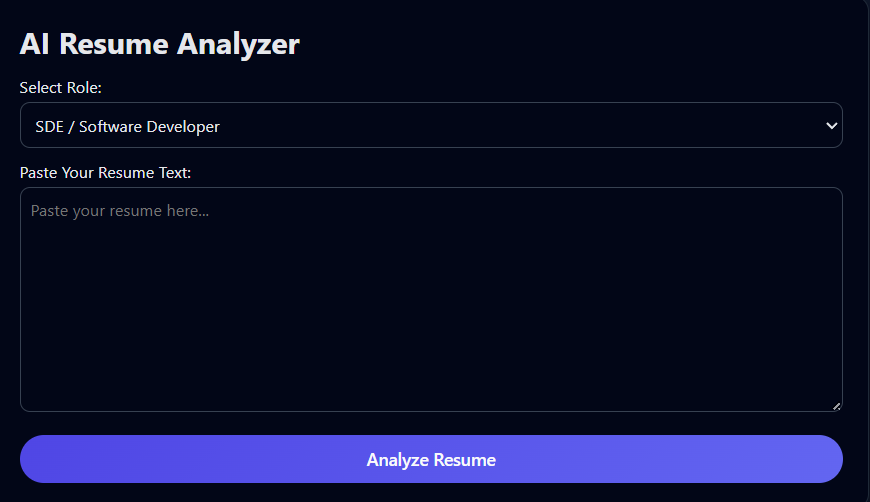
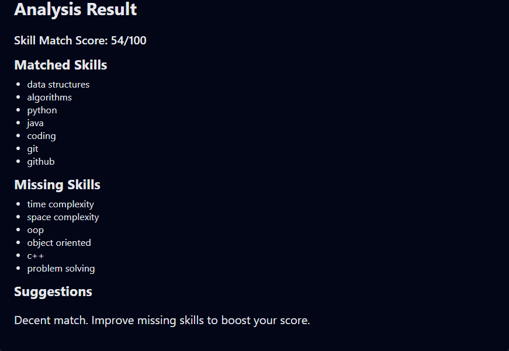

# 🧠 AI Resume Analyzer – JavaScript (Client-Side)

A lightweight, fast, and smart resume analysis tool that evaluates resume content based on role-specific skills.
It generates a Skill Match Score, identifies matched/missing skills, and gives improvement suggestions — all running 100% in the browser.

Perfect for job seekers, students, and developers preparing for placements & internships.

🔥 Built with Pure JavaScript — No Backend Required
⚡ Instant Analysis • 🎯 Role-Specific • 💻 Completely Offline

# 📸 Screenshots

| Input Page | Analysis Result |
|------------|-----------------|
|  |  |

Input Page	Analysis Result

	

# 🚀 Features
✔ Role-Based Resume Evaluation

Choose from 3 roles:

🧑‍💻 Software Developer (SDE)

🌐 Web Developer

🤖 Machine Learning Engineer

Each role has its own skill set.

# ✔ Smart Skill Extraction

The tool analyzes your resume text for:

Matched skills

Missing skills

Weak areas

Strong areas

# ✔ Skill Match Score (0–100)

A simple scoring system:

80–100: Strong resume

50–79: Decent but needs improvement

0–49: Weak → Missing important skills

# ✔ Actionable Suggestions

Based on your score, you get:

Resume tips

Skill recommendations

Project suggestions

# ✔ 100% Client-Side

No server

No database

No API calls

Your resume stays secure in your browser

# 🛠 Tech Stack
Technology	Purpose
HTML5	UI structure
CSS3	Styling & layout
JavaScript (ES6)	Resume analysis logic
Git + GitHub	Version control & portfolio showcase
# 📁 Project Structure
ai-resume-analyzer/
│
├── index.html      # UI layout
├── style.css       # Styling
├── script.js       # Resume analysis logic
└── images          # Screenshots 

# 📦 Installation & Usage
1. Clone the repository
git clone https://github.com/anuranjansb/ai-resume-analyzer.git

2. Open project folder
cd ai-resume-analyzer

3. Run in browser

Just open:

index.html

4. Paste your resume text

Select your target role → click Analyze Resume → get results.

# 🔮 Future Enhancements (Level 2 & Level 3)
⚡ Level-2 (AI + NLP Upgrade)

TF-IDF vectorization (Python backend)

Cosine similarity scoring

Resume PDF upload

NLP-based skill extraction

Keyword highlighting

⚡ Level-3 (Full-Stack Deployment)

Flask / FastAPI backend

Beautiful frontend dashboard

Authentication & resume history

Host on Render / Vercel

Advanced scoring (projects, experience, achievements)

These will make it a true portfolio-grade AI product.

# 👤 Author

Anuranjan SB
📍 CSE (AI & ML) Student
📧 Email: anuranjan.sb-04@gmail.com

🔗 GitHub: https://github.com/anuranjansb

🔗 LinkedIn: https://www.linkedin.com/in/anuranjan-sb-5b2500255/

📄 License

This project is licensed under the MIT License.
